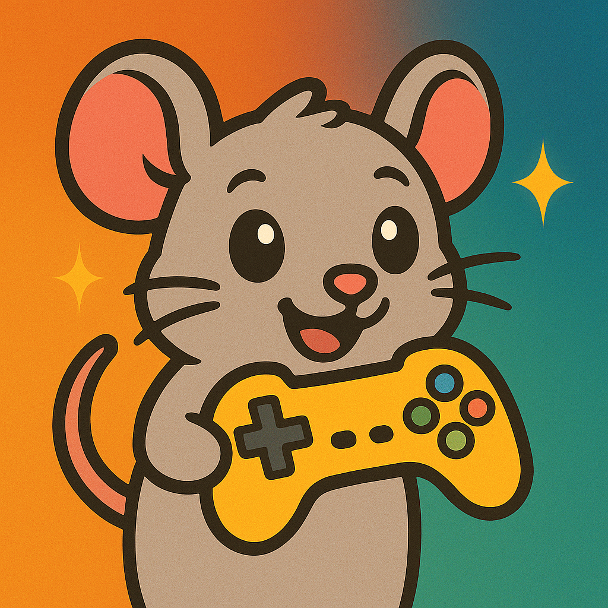

# mouse

An iOS arcade game collection built with SpriteKit. The app features a main menu with an animated mouse background and seven mini-games.



## Games

| Game | Description |
|------|-------------|
| **Collect Coins** | Dodge enemies and collect coins using physics-based movement |
| **Shell Game** | Track the ball under shuffling shells — gets harder as your score rises |
| **Rock Paper Scissors** | Classic RPS against the computer |
| **How Many Balls** | Count the number of balls displayed before time runs out |
| **Memory Card Game** | Flip and match flower cards with the fewest moves |
| **Sweet Stack** | Tap at the perfect moment to stack falling desserts — miss and your tower collapses |
| **Cheese Chase** | Navigate a mouse through a maze to collect cheese before time runs out |

## Requirements

- Xcode 15+
- iOS 16+
- Swift 5.9+

## Build

```bash
# Build for iPhone 16 simulator
xcodebuild -scheme mouse -destination 'platform=iOS Simulator,name=iPhone 16' build
```

Open `mouse.xcodeproj` in Xcode to run directly on a simulator or device.

## Project Structure

```
mouse/
├── GameViewController.swift      # Entry point — presents MenuScene
├── MenuScene.swift               # Main menu with animated mouse background
├── CollectCoinsScene.swift       # Dodge-and-collect game
├── ShellGameScene.swift          # Shell game
├── RockPaperScissorsScene.swift  # Rock-paper-scissors
├── HowManyBallsScene.swift       # Ball counting game
├── MemoryCardScene.swift         # Memory card matching game
├── SweetStackScene.swift         # Precision timing stacking game
├── CheeseChaseScene.swift        # Maze navigation game
├── Assets.xcassets/              # App icons and assets
└── Sounds/                       # Sound effects (.caf, .mp3)
```
